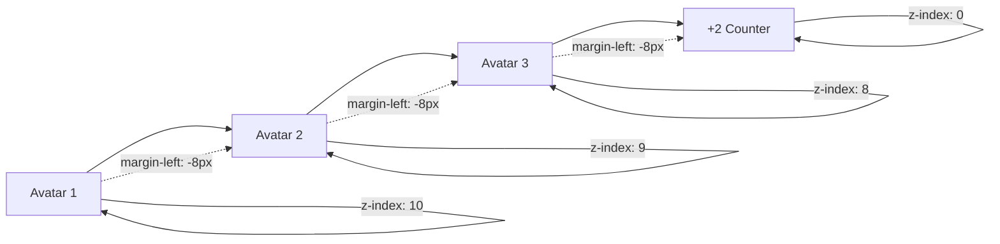
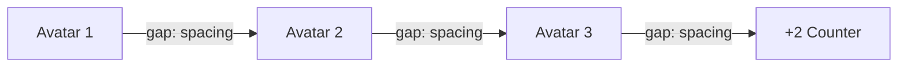

# Архитектура AvatarGroup

## Структура компонента

```mermaid
graph TD
    A[AvatarGroup] --> B[AvatarGroupContainer]
    B --> C[AvatarWrapper]
    B --> D[AvatarCounter]

    C --> E[Avatar Component]
    E --> F[AvatarImage/AvatarFallback]
    E --> G[Badge для сообщений]
    E --> H[Tooltip]

    D --> I[+N Counter]

    J[AvatarGroupProps] --> A
    J --> K[variant: STACK | ROW]
    J --> L[maxVisible: number]
    J --> M[avatars: Array]
    J --> N[size: Size]
    J --> O[spacing: number]
```

## Варианты отображения

### STACK (наложение)



### ROW (в ряд)



## Стили

### AvatarGroupContainer

- `display: flex`
- `align-items: center`
- Для STACK: отрицательные отступы и z-index
- Для ROW: gap между элементами

### AvatarWrapper

- `position: relative`
- `display: inline-block`
- Белая обводка для отделения

### AvatarCounter

- Круглая форма
- Фон из темы
- Hover эффекты
- Позиционирование в зависимости от варианта

## Логика работы

1. **Ограничение видимых аватаров**: `avatars.slice(0, maxVisible)`
2. **Подсчет скрытых**: `avatars.length - maxVisible`
3. **Рендеринг счетчика**: только если `remainingCount > 0`
4. **Передача пропсов**: все пропсы аватара передаются в компонент Avatar
5. **Тултипы**: глобальный `showTooltip` или индивидуальный для каждого аватара
